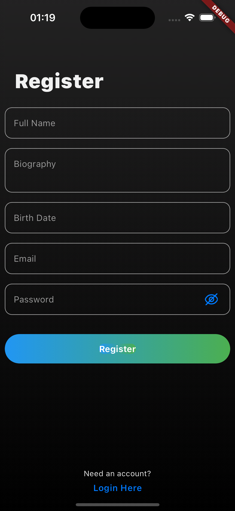

# firebase auth with flutter

Flutter authentication with firebase auth and firestore.

## Notes and Explanation

- Application uses MVC-S architecture.
- For state management, RiverPod package is used.
- Application uses firebase auth for authentication.
- Application uses firebase firestore for storing user data.
- User hobbies are fetching real time from firestore using stream.
- User authentication is handled with firebase auth stream.
- Application uses go_router package for routing.
- Application uses go_router_builder, riverpod_generator for generating routes and providers.

 

## Features

- Sign in
- Sign up
- Sign out
- Add hobby
- Delete hobby

## Demo

## Used Packages and Versions

**Packages:** hooks_riverpod, flutter_hooks, riverpod_annotation, go_router, flutter_screenutil, flutter_svg, delightful_toast, firebase, equatable, flutter_animate

**Dart Version:** 3.2.3

**Flutter Version:** 3.16.4

 
